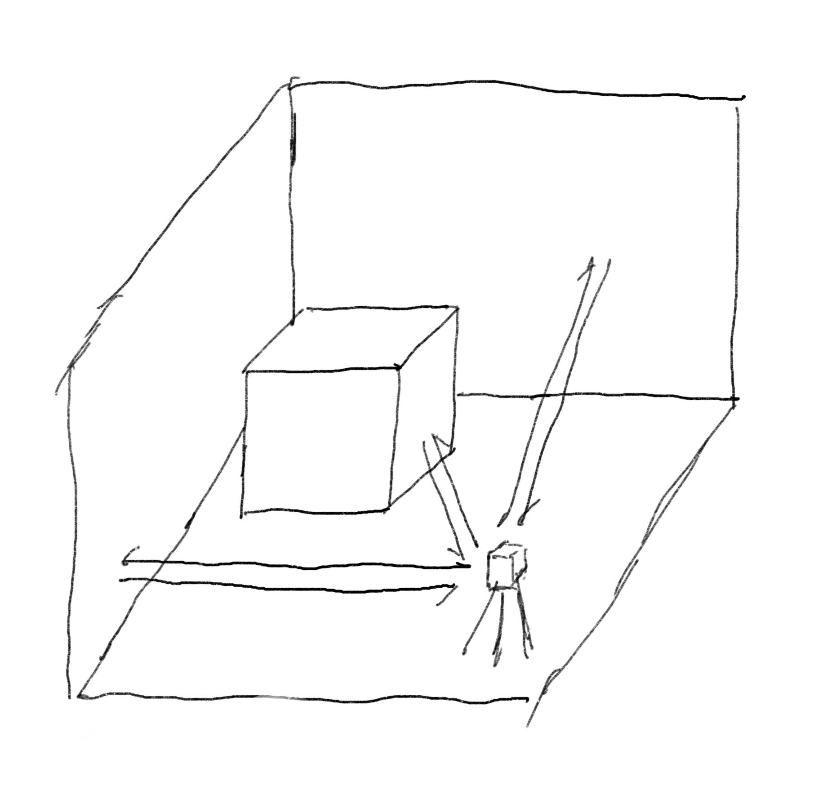
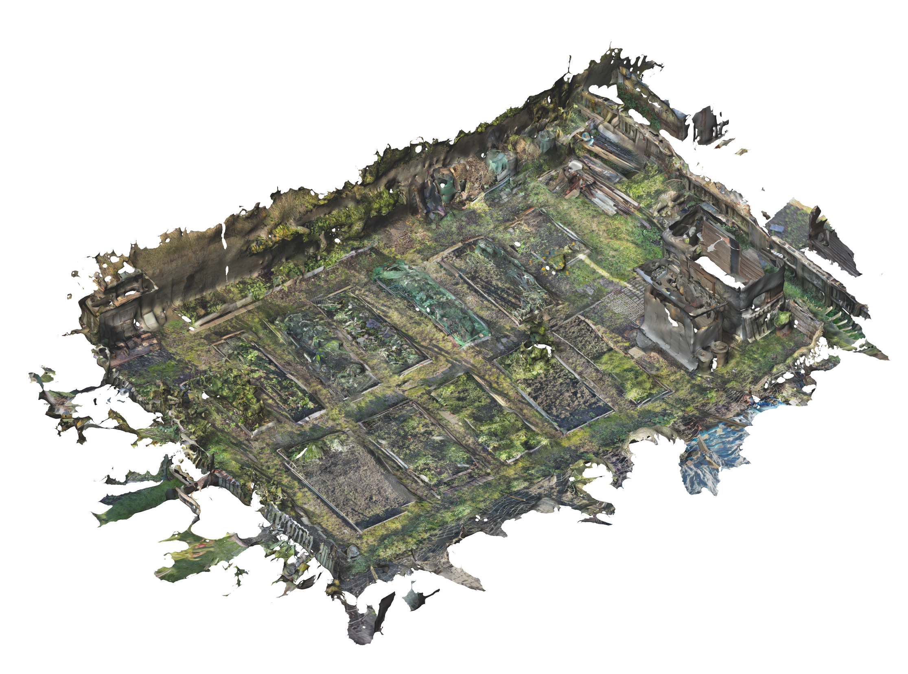
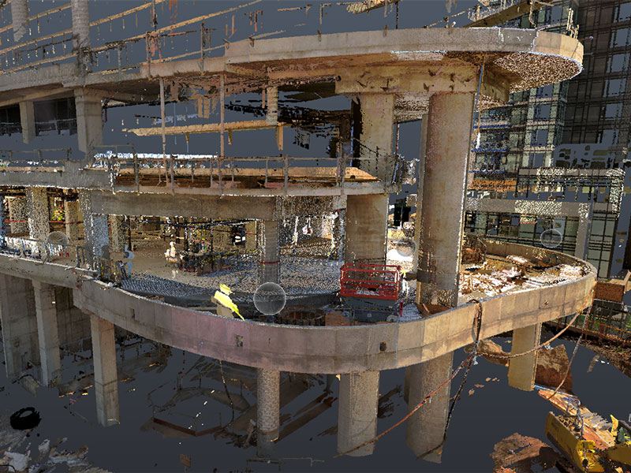
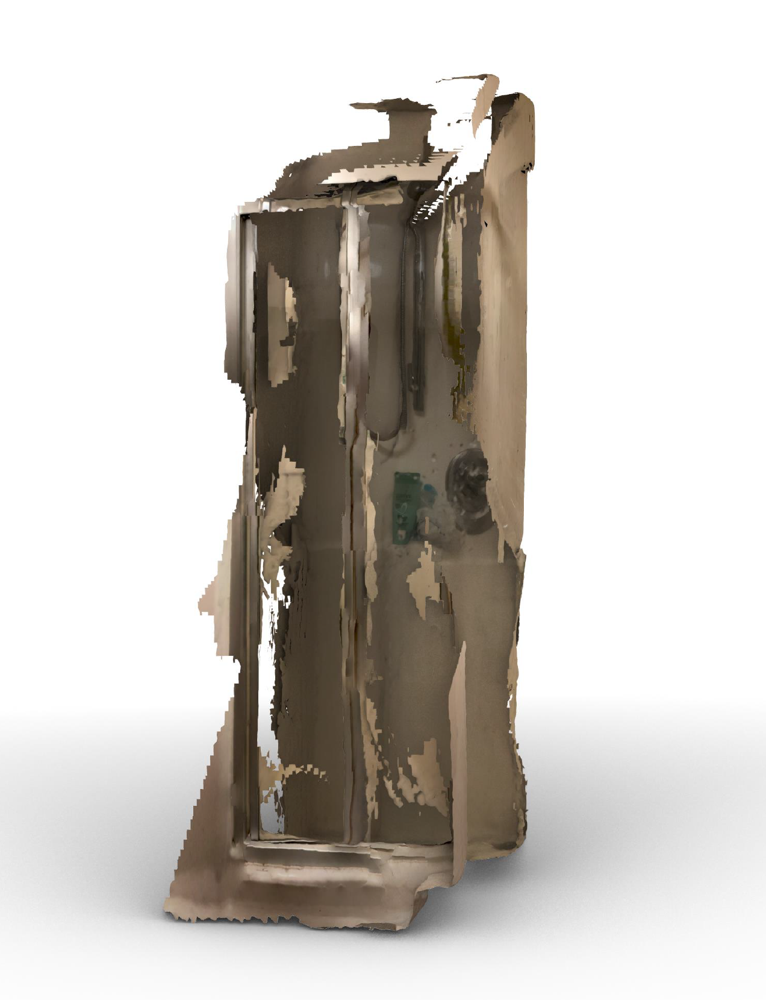

# Summary
## Basic concepet

```{r, load_refs, include=FALSE, cache=FALSE}
library(RefManageR)
BibOptions(check.entries = FALSE,
           bib.style = "authoryear",
           cite.style = "authoryear",
           style = "markdown",
           hyperlink = TRUE,
           dashed = FALSE,
           no.print.fields=c("doi", "url", "urldate", "issn"))
myBib <- ReadBib("./reference.bib", check = FALSE)
```

.blue[LiDAR](the short for Light Detection and Ranging) is a is a remote-sensing technology that uses pulsed laser energy (light) to measure ranges (distance), which is uesd in accurately and precisely map and measure natural and constructed features on the earth’s surface, within buildings, underground, and in shallow water`r Citet(myBib,"IntroductionLidarData2018")`. 


```{r setup, include=FALSE}
options(htmltools.dir.version = FALSE)
```

```{r xaringan-all,include=FALSE, echo=FALSE}
library(countdown)
library(xaringan)
library(xaringanExtra)
library(knitr)
library(xaringanthemer)

hook_source <- knitr::knit_hooks$get('source')
knitr::knit_hooks$set(source = function(x, options) {
  x <- stringr::str_replace(x, "^[[:blank:]]?([^*].+?)[[:blank:]]*#<<[[:blank:]]*$", "*\\1")
  hook_source(x, options)
})

xaringanExtra::use_broadcast()
xaringanExtra::use_freezeframe()
xaringanExtra::use_scribble()
#xaringanExtra::use_slide_tone()
xaringanExtra::use_search(show_icon = TRUE, auto_search	=FALSE)
xaringanExtra::use_freezeframe()
xaringanExtra::use_clipboard()
xaringanExtra::use_tile_view()
xaringanExtra::use_panelset()
xaringanExtra::use_editable(expires = 1)
xaringanExtra::use_fit_screen()
xaringanExtra::use_extra_styles(
  hover_code_line = TRUE,         
  mute_unhighlighted_code = TRUE  
)

```

---
# Summary
## Working princinple 

```{r echo=FALSE, out.width='25%',fig.align='center'}

```
.pull-middle[
.small[Distance to Object = (Speed of Light * Time)/2]
]
The working pricinple of .blue[LiDAR] is  use infrared light to calculate the depth of the room. To be specific, by calculating the time that light leaves the device, bounces off an object or plane, and returns to the device, so that get the distance between the device and the object.
But here is one point which needs to be mentioned that although .blue[LiDAR] and .blue[TOF](Time of Flight) are essentially the same thing, i.e. all LiDAR is a type of TOF, we cannot say that all Time of Flight is LiDAR.
The function difference between them is that LiDAR ues laser to build point cloud, whereas other TOF is usually create depth map `r Citet(myBib, "jaehingToFVsLiDAR2020")`.

---
# Application
## Scan and build model
.pull-center[
```{r echo=FALSE, out.width='60%',fig.align='center'}

```

.small[The model of allotment]
]

Last year, when I was doing my first master in the University of Edinburgh, I scanned the whole allotment using a 3D Scanner supported by a LiDAR sensor to support my following research. 

---
# Application
## Practical project applications 
```{r echo=FALSE, out.width='40%',fig.align='center'}

```
.pull-middle[
.small[A Visual from LiDAR Scanning Services`r Citet(myBib, "frontermetrologyLiDARScanningUse2022")`]
]
LiDAR is also used in a wide range of applications in industry. Specifically in the construction industry, LiDAR technology can help us to quickly scan and build real-world buildings and environments with sufficient detail to reduce economic and time costs.
In the post-completion inspection phase of a project, LiDAR technology can be used to help identify safety hazards thanks to its greater accuracy.
---
# Reflection
## Limitation and strength 
```{r echo=FALSE, out.width='40%',fig.align='center'}

```
.pull-center[
.small[LiDAR pulse directly through the glass]
]
However, it needs to be acknowledged that there are still limitations to LiDAR as a technology. In my experience with LiDAR scanning and modelling, I have found that LiDAR has some problems: for example, it is not possible to scan glass because the light penetrates the glass. When confronted with dense vegetation, LiDAR pulses cannot penetrate the surface and thus cannot obtain information about its interior.
Despite these problems, LiDAR has its own merits and has a wide scope for use. Specifically, LiDAR has a higher level of accuracy and can capture sufficient detail in the scanning and modelling process. Also, thanks to the active illumination sensor, LiDAR can be used regardless of time constraints.

---
# Reference
```{r results='asis', echo=FALSE}
PrintBibliography(myBib)
```

